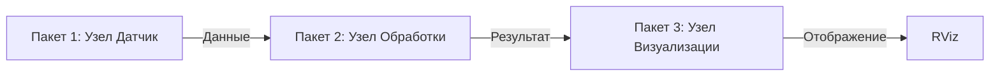

@ - отложено до того момента как программа не будет послностью дописана
# @cmd_to_high_level_control_package
## Осталось
- Сделать аннотацию в python-коде
- Сделать описание в setup.py
- Сделать описание в package.xml
## Данное состояние
- Нода работает, но не описана

# @low_level_control
## Осталось
- Проверить код обоих нод по pep8
- Проверить аннотацию в python-кодах
- Сделать описание в setup.py
- Сделать описание в package.xml
## Данное состояние
- Нода работает, но не описана
- работа кистей не проверена

# @slider_control
## Осталось
- Проверить код по pep8
- Сделать аннотацию в python-коде
- Сделать описание в setup.py
- Сделать описание в package.xml
## Данное состояние
- Нода работает, но не описана


# unitree_h1_control_ws
В данном репозитории лежат ROS2-пакеты, которые позволяют контролировать движения робота Unitree H1. Пакеты релизовывают как low-level движение, так и high-level движение. 

## 📦 Содержание Репозитория
*   **`cmd_to_high_level_control_package`**: Вторая программа, анализирующая комадны из **`teleop_twist_keyboard`** и приводящая Unitree H1 в необходимое движение.
*   **`hands_init`**: Модуль, поднимающий ROS2-топики для работы с манипуляторами Inspire hands.
*   **`high_level_control`**: содержит high-level клиент, который позоляет управлять движением робота и измениять состояние робота .
*   **`low_level_control`**: Модуль, который отправляет непосредственное воздействие прямиком на моторы робота Unitree H1 и отвечает за безопасность дживений робота как для окружающих, так и для себя самого.
*   **`slider_conrtol`**: Позволяет задать положение робота  с помощью графического интерфейса.
*   **`teleop_twist_keyboard`**: Программа телеуправления, адаптированная под Unitree H1.
*   **`wrist_control_package`**: Управление моторами, которые отвечаают за вращение кистей.
*    **`completed_scripts_control`**: Файлы запуска (`*_launch.py`) для всего репозитория/системы.
*   ==**`docs/`**: Дополнительная документация (если есть)==.
*   **`README.md`**: Этот файл.
*   **`save.bash`**: Скрипт для быстрой выгрузки на github

## 🚀 Быстрый Старт
Пошаговая инструкция для **быстрого** запуска демо или основной функциональности. Предполагаем, что ROS2 уже установлен.

1.  **Клонировать репозиторий** в `src` вашего workspace:
   ```bash
    mkdir -p unitree_h1_control_ws/src
    cd unitree_h1_control_ws/src
    git clone https://github.com/cyberbanana777/unitree_h1_control_ws.git .
    ```
2. **Установить проприетарные зависимости** (по ссылкам инструкции по установке от производителя): 
-   [unitree_sdk2py](https://github.com/unitreerobotics/unitree_sdk2_python)
-   [unitree_ros2](https://github.com/unitreerobotics/unitree_ros2)
3.  **Установить зависимости**:
  ```bash
    cd unitree_h1_control_ws
    rosdep install --from-paths src --ignore-src -y  # Основные ROS зависимости
    pip install numpy pyserial tk
    sudo apt-get install libboost-all-dev libspdlog-dev
    ```
4.  **Собрать workspace:**
    ```bash
    colcon build
    source install/setup.bash  # Или setup.zsh
    ```
5.  ==**Запустить пример / основной функционал:**==
    ```bash
    ros2 launch пакет_1 основной_запуск.launch.py
    # ИЛИ
    ros2 run пакет_1 основной_узел
    ```

## ⚙️ Предварительные Требования

Детализируйте *все*, что нужно *до* шагов "Быстрого Старта":

*   **Поддерживаемые версии ROS2:** Foxy
*   **Поддерживаемые платформы:** Ubuntu 22.04
*   **Ключевые ROS2 пакеты:** `rclpy`, `std_msgs`, geometry_msgs`, `unitree_go`
*   **Сторонние зависимости:** numpy, serial, tkinter

## 🧪 Использование

Как пользоваться пакетами *после* установки и сборки.

*   **Запуск узлов:**
    *   Перечислите основные **исполняемые файлы (узлы)** из каждого пакета и как их запускать.
        ```bash
        ros2 run пакет_1 узел_а  # Запуск узла А из пакета 1
        ros2 run пакет_2 узел_б --ros-args -p параметр:=значение  # С параметром
        ```
*   **Запуск Launch файлов:**
    *   Опишите ключевые **launch файлы** и что они запускают (целые системы, конфигурации).
        ```bash
        ros2 launch пакет_1 demo.launch.py
        ros2 launch пакет_2 sensor_and_processing.launch.py
        ```
*   **Конфигурация (Параметры, Топики, Сервисы):**
    *   Укажите, как задавать параметры (через launch файлы, YAML, командную строку).
    *   Перечислите **основные публикуемые/подписываемые топики** (с типами сообщений).
    *   Перечислите **предоставляемые/используемые сервисы** (с типами сервисов).
    *   Упомяните файлы конфигурации в `config/` и как они применяются.
*   **Визуализация (RViz):**
    *   Если есть конфиги RViz (`*.rviz`), укажите, как их загружать.
    ```bash
    rviz2 -d src/репозиторий/пакет_3/config/моя_визуализация.rviz
    ```

## 📡 Интерфейс (Топики, Сервисы, Действия, Параметры)

Детальная спецификация API пакетов. Обычно таблицы.

*   **Пакет 1: Имя Пакета**
    *   **Узел: `узел_а`**
        *   Публикуемые топики:
            | Топик                 | Тип сообщения                | Описание                     |
            | :-------------------- | :--------------------------- | :--------------------------- |
            | `/output_topic`       | `std_msgs/msg/String`        | Описание вывода...           |
        *   Подписываемые топики:
            | Топик                | Тип сообщения                | Описание                     |
            | :------------------- | :--------------------------- | :--------------------------- |
            | `/input_topic`       | `sensor_msgs/msg/Image`      | Описание ввода...           |
        *   Сервисы:
            | Сервис               | Тип сервиса                  | Описание                     |
            | :------------------- | :--------------------------- | :--------------------------- |
            | `/do_something`      | `пакет_1/srv/DoSomething`    | Описание сервиса...         |
        *   Параметры:
            | Параметр             | Тип (знач. по умол.)         | Описание                     |
            | :------------------- | :--------------------------- | :--------------------------- |
            | `use_sim_time`       | `bool (false)`               | Использовать симуляц. время?|
*   **Пакет 2: Имя Пакета**
    *   ... (Аналогично)

## 🗺️ Архитектура (Опционально, но рекомендуется)

Диаграмма (или текстовое описание) как пакеты и узлы взаимодействуют друг с другом и с внешними системами (e.g., другие ROS2 пакеты, оборудование). Можно использовать Mermaid (GitHub его поддерживает) или ссылку на изображение.



## Credits
This project uses/modifies code from the [Unitree Robotics SDK](https://github.com/unitreerobotics), which is licensed under the **BSD 3-Clause License**.

## Предложения и корректировки
Если Вы нашли, ошибку, неточность, у Вас есть предложения по улучшению или вопросы, то напишите в телеграмм [сюда](https://t.me/Alex_19846) (Александр) или [сюда](https://t.me/Kika_01) (Алиса).